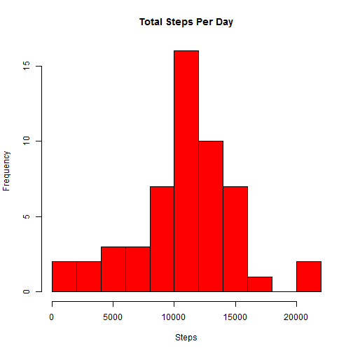
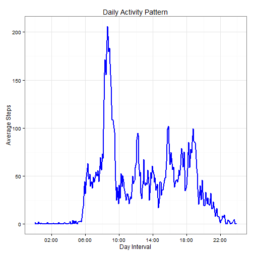
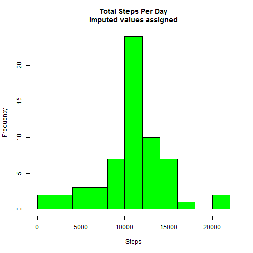
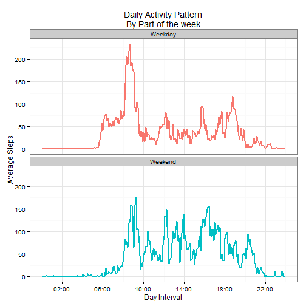

This is an analysis of movement data from a wearable device. It looks at total number of steps, on a daily basis, and activity at different times of day. The total steps are checked again after imputing values for missing measurements. Finally, activity patterns are compared between weekdays and weekends.

## Loading and preprocessing the data
The data come from a zip file assumed to be available in the working directory. The actual data file is extracted from the zip file and loaded. The date column is converted from a character field to a Date, and a new column is added representing the interval as a POSIXct time.


```r
## Pull in needed packages
suppressWarnings(require(dplyr))
suppressWarnings(require(data.table))
suppressWarnings(require(ggplot2))
suppressWarnings(require(scales))


## Set up constants
tempdir<-"./tempdata"
zipfile<-"activity.zip"
targetfile<-"activity.csv"
fullfile<-paste(tempdir,targetfile,sep="/")
                 
## Check for data file and pull it in.
if( !file.exists(zipfile)){
        stop("File activity.zip required in working directory.")
}

## Read in the data
if(!file.exists(tempdir))
        dir.create(tempdir)
unzip(zipfile=zipfile, files=targetfile, exdir=tempdir)
rawdata<-tbl_df(read.csv(fullfile, stringsAsFactors=FALSE)) %>%
        mutate(date=as.Date(date,"%Y-%m-%d")) %>%
        mutate(hourMin=as.POSIXct(strptime(sprintf("%04d",interval),"%H%M")))
```


## What is mean total number of steps taken per day?
Compute the total number of steps for each day, then find the mean and median of this total.

```r
stepsPerDay<-rawdata %>%
        group_by(date) %>%
        summarize(totalSteps=sum(steps,na.rm=TRUE))

averageSteps<-sprintf("%7.2f",mean(stepsPerDay$totalSteps,na.rm=TRUE))
medianSteps<-sprintf("%7.2f",median(stepsPerDay$totalSteps,na.rm=TRUE))

hist(stepsPerDay$totalSteps,breaks=10,col="red",main="Total Steps Per Day", xlab="Steps")
```

 


The mean total number of steps for the sample is 9354.23.  

The median total number of steps for the sample is 10395.00.


## What is the average daily activity pattern?
For each interval, represented as a POSIXct, determine the average number of steps. From this, find the interval with the highest number.

```r
activityPattern<-rawdata %>%
        group_by(hourMin) %>%
        summarize(averageSteps=mean(steps,na.rm=TRUE))

topInterval<-filter(activityPattern,averageSteps==max(averageSteps))%>%
        inner_join(rawdata,by="hourMin")%>%
        select(interval,hourMin,averageSteps)%>%
        distinct()


ggplot(
        data=activityPattern, 
        aes(x=hourMin,y=averageSteps))+
        geom_line(col="blue",size=1)+theme_bw()+
        scale_x_datetime(breaks="4 hours", labels=date_format("%H%:%M"))+
        xlab("Day Interval")+ylab("Average Steps")+ggtitle("Daily Activity Pattern")
```

 

### Top Interval
The interval with the highest average steps across all days is 835 (08:35) with an average of 206.1698113 steps.

## Imputing missing values
### Quantify
There are a number of missing values for the step measurement. The first step is to quantify, then values will be assigned to them.

```r
missing.date<-sum(is.na(rawdata$date))
missing.interval<-sum(is.na(rawdata$interval))
missing.steps<-sum(is.na(rawdata$steps))
```

Missing values for the data set:

+       Date: 0

+       Interval: 0

+       Steps: 2304

### Assign Values
Use the average steps for each interval, computed above, to supply missing values and repeat
the daily step total analysis to see how it changes.

```r
imputeActivity<-rawdata %>%
        inner_join(activityPattern, by="hourMin") %>%
        mutate(imputedSteps=ifelse(is.na(steps),averageSteps,steps))

## Analysis of steps per day
imputedStepsPerDay<-imputeActivity %>%
        group_by(date) %>%
        summarize(totalSteps=sum(imputedSteps))


averageStepsImputed<-sprintf("%7.2f",mean(imputedStepsPerDay$totalSteps))
medianStepsImputed<-sprintf("%7.2f",median(imputedStepsPerDay$totalSteps))

hist(imputedStepsPerDay$totalSteps,breaks=10,col="green",main="Total Steps Per Day\nImputed values assigned", xlab="Steps")
```

 

The mean total steps, after removing missing values is 10766.19.

The median total stpes, after removing missing values is 10766.19.

### Observations
After imputing measurements for missing values, the average step per day has gone up slightly. The graph shows fewer low values, and a larger grouping around the mean. This strategy causes the mean and median to be the same.


## Are there differences in activity patterns between weekdays and weekends?
Using the data set with imputed values, this analysis looks at the difference between weekday activity and weekend activity for the date range recorded.

### Add a Factor
First, a new factor variable is added to the data set to differentiate week days from weekend days.


```r
## Add a factor variable to the data
imputeActivity<-imputeActivity %>%
        mutate(weekPart=as.factor(
                ifelse(weekdays(date) %in% c("Saturday","Sunday"),"Weekend","Weekday")))
```

### Look at the results

```r
## Compute average steps by part of the week.
weekPartPattern<-imputeActivity %>%
        group_by(weekPart,hourMin) %>%
        summarize(averageSteps=mean(steps, na.rm=TRUE))

ggplot(
        data=weekPartPattern, 
        aes(x=hourMin,y=averageSteps,col=weekPart))+
        geom_line(size=1)+
        theme_bw()+theme(legend.position="none")+
        facet_wrap(~weekPart,nrow=2)+
        scale_x_datetime(breaks="4 hours", labels=date_format("%H%:%M"))+
        xlab("Day Interval")+ylab("Average Steps")+
        ggtitle("Daily Activity Pattern\nBy Part of the week")
```

 

### Observations
There is a difference between weekdays and weekends. On weekdays, the activity starts earlier, but is lower in the middle of the day. The weekends have elevated activity across much of the day.

## Clean up files and directory.

```r
file.remove(fullfile)
```

```
## [1] TRUE
```

```r
unlink(tempdir)
```

